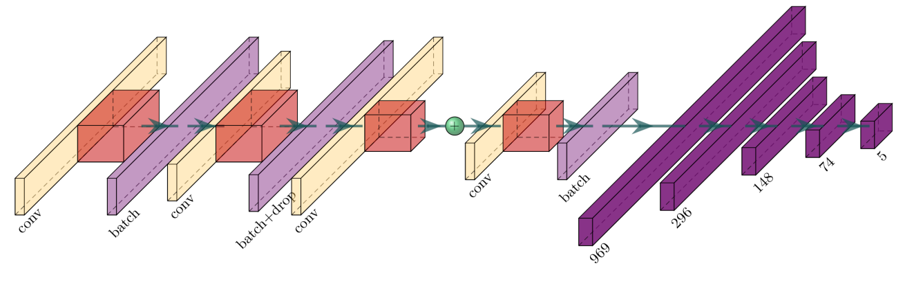

<h1 align="center" > A 1D CNN for high accuracy classification and transfer learning in motor 
imagery EEG-based brain-computer interface </h1>


<p align="center">
<a href="https://github.com/Kubasinska/MI-EEG-1D-CNN/issues"></a>
<a href="https://github.com/Kubasinska/MI-EEG-1D-CNN/issues"></a>
<a href="https://github.com/Kubasinska/MI-EEG-1D-CNN/issues"></a>
<a href="https://github.com/Kubasinska/MI-EEG-1D-CNN/issues"></a>
<a href="https://github.com/Kubasinska/MI-EEG-1D-CNN/issues"></a>
<a href="https://github.com/Kubasinska/MI-EEG-1D-CNN/blob/master/LICENSE.txt"></a>
<a href="https://twitter.com/intent/tweet?text=Wow:&url=https%3A%2F%2Fgithub.com%2FKubasinska%2FMI-EEG-1D-CNN"></a>
<a href="https://twitter.com/FrancescoMattio"></a>
<a href=""></a>
<a href=""></a>
<a href=""></a>
<a href=""></a>
<a href=""></a>
<a href=""></a>
<a href=""></a>
<a href="https://doi.org/10.1088/1741-2552/ac4430"></a>
<a href=""></a>
<a href="https://doi.org/10.1088/1741-2552/ac4430"></a>
<a href=""></a>
<a href="https://doi.org/10.1088/1741-2552/ac4430"></a>
<a href="https://doi.org/10.1088/1741-2552/ac4430"></a>

<h2 align="center" > What is this? </h2>
<div> A new Brain Computer Interface (BCI) approach based on a 10-layer one-dimensional convolution 
neural network (1D-CNN) to classify five brain states (four Motor Imagery classes plus a 'baseline' class) using a data augmentation algorithm and a limited number of EEG channels. The model tested with the 'EEG Motor Movement/Imagery Dataset' outperforms the current state-of-the-art models by achieving a 99.38% accuracy at the group level. In addition, the transfer learning approach we present achieves an average accuracy of 99.46%.</div> 

<div align="center">

</div>

<h3 align="center" > Reference paper </h3>
 <div> Mattioli F, Porcaro C, Baldassarre G. <a href="https://iopscience.iop.org/article/10.1088/1741-2552/ac4430">A 1D CNN for high accuracy classification and 
transfer learning in motor imagery EEG-based brain-computer interface </a>. J Neural Eng. 2022 
Jan 6;
18(6). doi: 10.1088/1741-2552/ac4430. PMID: 34920443. </div> 

<h2 align="center" > Usage </h2>

<h3 align="center" > Install the dependencies </h3>

In order to train the network (and perform inference) you need to install the dependencies. There are two ways to install dependencies: (1) **Using a docker container** (recommended), (2) **Using a python environment**. An NVIDIA GPU with at least 6 GB is also recommended. The network was trained with an NVIDIA RTX 2060 and an NVIDIA TESLA P100, the former taking about 30 minutes to train, the latter about 15 minutes.

<h5 align="center" > Using a docker container (recommended) </h5>

<a href="https://www.docker.com/resources/what-container">What is a docker container? </a>
<div>
In addition to docker we also recommend installing <a href="https://developer.nvidia.
com/nvidia-container-runtime#:~:text=NVIDIA%20Container%20Runtime%20is%20a,
desktop%2C%20cloud%20or%20data%20centers.">NVIDIA Container Runtime (v2) </a> which allows you 
to create containers that use your nvidia GPU. Guide: <a href="https://docs.nvidia.
com/datacenter/cloud-native/container-toolkit/install-guide.html">NVIDIA Container Runtime (v2) 
installation guide.
 </a>
The container building process has been tested on Ubuntu 20.04. If you have a Windows machine you can try Windows Linux Subsystem but it has not been tested yet (If you test it, tell us about your experience by opening an issue.).
</div>

Assuming you have docker installed. Building the container is straightforward. 
1. **Clone this repository** `git clone https://github.com/Kubasinska/MI-EEG-1D-CNN.git`
2. **Open a shell** and `cd` into the docker folder `MI-EEG-1D-CNN/docker`
3. **Run** `docker build -t eegcnn .` Depending on the permissions set on your machine you may need to run this command as root by adding `sudo` at the beginning. This command  will build a new container called `eegcnn`. This may take a few minutes. During the build process, the original dataset is downloaded and generated as described in the methods section of the original paper. Once the container is built, you already have everything ready.
4. Run the container to check that everything has been installed correctly. To launch the container, go to the working directory of the `MI-EEG-1D-CNN` repository. You can launch the container in several ways; here, we recommend 2, one that allows you to plot graphs and one that does not.
   1. **I want to see some graphs**. If you want to see graphs, you must allow the container to access your screen To do this, **run** `xhost +local:root`; this exposes your xhost so that the container can render the correct display by reading and writing through the X11 unix socket. Then, from the working directory of the repository launch: ```docker run -it --gpus all -v $(pwd):/workspace -v /tmp/.X11-unix:/tmp/.X11-unix:rw -e DISPLAY=unix$DISPLAY --device /dev/dri --privileged -v /home/$USER/. Xauthority:/root/.Xauthority eegcnn bash```. This will open a bash shell inside the container, and you are good to go! If you don't have an NVIDIA GPU or have NVIDIA Container Runtime (v2) installed, omit `--gpus all`. **When you close the container, remember to launch `xhost -local:root`**.
   2. **I don't care about graphs**. In this case, it is much easier! Just run: `docker run -it 
      --gpus all -v $(pwd):/workspace eegcnn bash` and you're in.

> **_NOTE:_**  All code paths are made, so you don't have to change anything using the container. For example, inside the directory `/dataset` of the container, you find three sub-folders `/dataset/original`, the original dataset data, `/dataset/paper` the data generated through the method described in the paper with the script `dataset_generator/generator.py`, and a third folder `/dataset/saved_models`, where the trained models automatically save after training. When you run the script to make an inference, you don't have to change anything because the python interpreter already knows where to get the trained model.

<h5 align="center" > Using a python environment. </h5>

This procedure is more straightforward but can create dependency issues based on your machine or operating system. Using this procedure, you must manually download the original dataset and generate 
the dataset used in the paper. You also need Anaconda or Miniconda to create a separate python environment. The following guide assumes you have Anaconda or Miniconda installed on your system.

1. Open a terminal and `cd` into the `MI-EEG-1D-CNN/docs` folder. **Run** `conda env create -f environment.yml`. These create a new python environment called `eeg` containing almost all necessary dependencies. The only dependencies missing are CUDA and cuDNN, which TensorFlow needs to use your GPU. If you don't have an NVIDIA GPU, go ahead. If you have an NVIDIA GPU, you need to install CUDA 10.1 and cuDNN 7.6 (be careful with the version, CUDA 10.2 or 10.0 is not good, you need 10.1, same for cuDNN). Please refer to the [official NVIDIA website for installation](https://developer.nvidia.com/cudnn), [here is a guide for windows](https://www.nientepanico.org/2021/02/20/humans-guide-to-tensorflow-gpu/).
2. **Download the EEG Motor Movement/Imagery Dataset** [here](https://physionet.org/content/eegmmidb/1.0.0/). The dataset is quite large (3.4 GB); it will take a while. Once downloaded, extract it. If you have wget you can download it from the terminal with the command. `wget -r -N -c -np https://physionet.org/files/eegmmidb/1.0.0/`.
3. **Generate the dataset**; this procedure simply takes the raw data and breaks it into the input dimension of the neural network. Use the script `MI-EEG-1D-CNN/dataset_generator/generator.py`. Change the dataset path to the path of the dataset you downloaded, and you are ready! Don't forget to run the script with the new conda environment `eeg`.


<h3 align="center" > Train the network(s) </h3>

From here on, we assume that all dependencies have been installed correctly.

<h5 align="center" > Directory structure </h5>

```shell
.
└── MI-EEG-1D-CNN/
    ├── data_processing/ # A module with useful functions
    │   └── general_processor.py
    ├── dataset_generator/ # Script that generates the dataset
    │   └── generator.py
    ├── docker/ # All the useful things to build the container
    │   ├── Dockerfile
    │   ├── environment.yml
    │   └── generator.py
    ├── docs/ # Scripts for inference and plotting
    │   ├── inference
    │   └── environment.yml
    ├── models/ # Scripts for training networks
    │   ├── hand_test
    │   └── transfer
    └── model_set/ # A module with all models
        └── models.py
```

The `data_processing` folder is **a module** that contains many helpful functions for assigning labels, generating the dataset as described in the paper, and other essential things. The `dataset_generator` folder contains the script that **generates the dataset**. Running the script `generator.py` with the correct paths creates a **new dataset** described in the paper. The script saves the data of each subject and channel combinations separately, so it is possible to load the data subject by subject into memory. The `docker` folder contains the Dockerfile and the `environment.yml` file. The `docs` folder contains the scripts for **inference and plotting**. Inside the inference subfolder, you can find **one script for each ROI** described in the paper (including the test without batch normalization and the test without SMOTE). There are also scripts to do transfer learning on the seven random subjects. Be careful; these scripts assume that there is a trained model. If you want to run these scripts, you must first train the models and save them. The scripts to train the models can be found in the folder `models`. Inside this folder, you will find a script for each ROI. The name pattern is `train_` and the corresponding letter of each ROI (`a,b,c,d,e,f`). For example, running the script `train_a.py` will start training the network with the ROI-A, composed of channels ( [FC1, FC2], [FC3, FC4], [FC5, FC6]). 

> **_Be careful;_** if you are using the container, you won't have any problems; the script already knows where to get the data and save the model. **If you are not using the docker container**, you will have to change the paths manually. `source_path` refers to the dataset generated through the `generator.py` script. `save_path` refers to the path where the trained model will be saved.

The `hand_test` subfolder contains the tests done on the network to evaluate the importance of data augmentation, checkpointing, and batch normalization. As usual, if you don't use our container, change the paths. The `transfer` subdirectory contains seven scripts that train the model with ROI-E and exclude a single subject. These scripts are used to evaluate transfer learning. The `model_set` folder contains the neural network (informally called HopefulNet) written in tensorflow using the subclass api.


<h4 align="center" > Problems? </h4>
If you experience any problems, feel free to contact me (Francesco.mttl@gmail.com) or open an issue. 


<h4 align="center" > Cite this paper </h4>

```
@article{mattioli20211d,
  title={A 1D CNN for high accuracy classification and transfer learning in motor imagery EEG-based brain-computer interface},
  author={Mattioli, Francesco and Porcaro, Camillo and Baldassarre, Gianluca},
  journal={Journal of Neural Engineering},
  year={2021},
  publisher={IOP Publishing}
}
```


