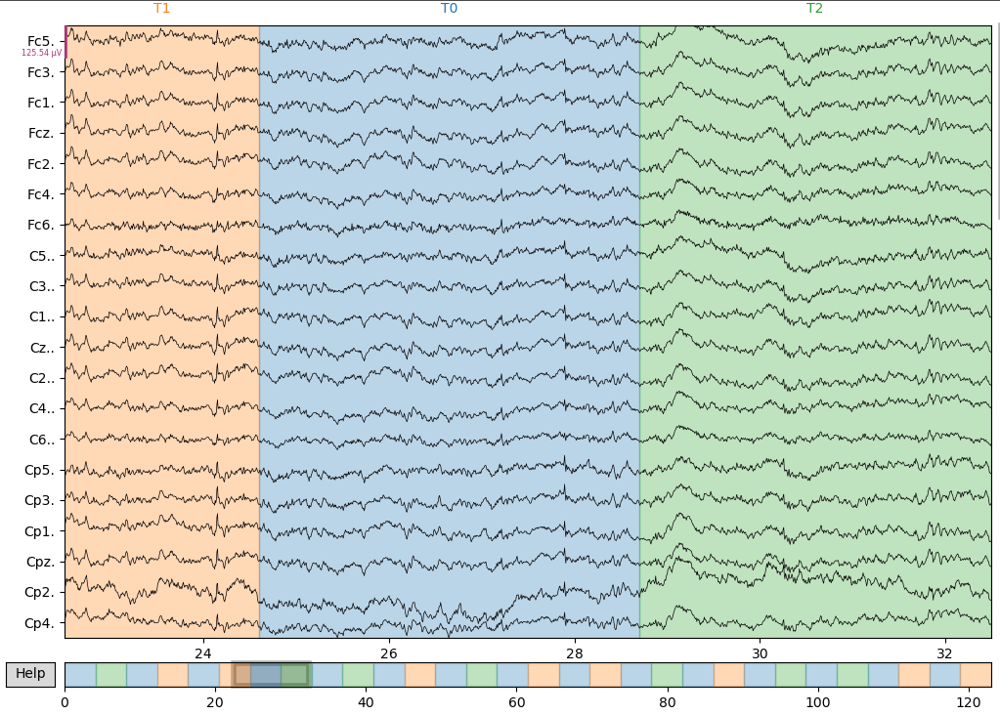

# Cosa stiamo facendo?

## Preprocessing (from raw data to matrices)

[Database source](https://physionet.org/content/eegmmidb/1.0.0/)
Come sono strutturate le directory del dataset:

```
.
└── eegbci/
    ├── S001/
    │   ├── S001R01.edf
    │   ├── S001R01.edf.event
    │   ├── S001R02.edf
    │   ├── S001R02.edf.event
    │   ├── S001R03.edf
    │   ├── S001R03.edf.event
    │   ├── ....
    │   ├── S001R14.edf
    │   └── S001R14.edf.event
    ├── S002
    ├── S003
    ├── ...
    ├── S109
    ├── 64_channel_sharbrough.pdf
    ├── 64_channel_sharbrough.png
    ├── ANNOTATORS
    ├── RECORDS
    ├── SHA256SUMS.txt
    └── wfdbcal
```


Il database è composta da 109 soggetti per 14 run così composte:

```
run 1. Baseline, eyes open
run 2. Baseline, eyes closed
run 3. Task 1 (open and close left or right fist)
run 4. Task 2 (imagine opening and closing left or right fist)
run 5. Task 3 (open and close both fists or both feet)
run 6. Task 4 (imagine opening and closing both fists or both feet)
run 7. Task 1 (open and close left or right fist)
run 8. Task 2 (imagine opening and closing left or right fist)
run 9. Task 3 (open and close both fists or both feet)
run 10. Task 4 (imagine opening and closing both fists or both feet)
run 11. Task 1 (open and close left or right fist)
run 12. Task 2 (imagine opening and closing left or right fist)
run 13. Task 3 (open and close both fists or both feet)
run 14. Task 4 (imagine opening and closing both fists or both feet)
```

Ne consegue che in totale i task sono 9 marcati in ogni run come T0, T1 e T2:

 ```
run 1. T0 = baseline (eyes open)
run 2. T0 = baseline, (eyes closed)
run 3. T0 = baseline, T1 = real movement left fist, T2 = real movement right fist
run 4. T0 = baseline, T1 = imagined movement left fist, T2 = imagined movement right fist
run 5. T0 = baseline, T1 = real movement both fists, T2 = real movement both feets
run 6. T0 = baseline, T1 = imagined movement both fists, T2 = imagined movement both feets
run 7. T0 = baseline, T1 = real movement left fist, T2 = real movement right fist
run 8. T0 = baseline, T1 = imagined movement left fist, T2 = imagined movement right fist
run 9. T0 = baseline, T1 = real movement both fists, T2 = real movement both feets
run 10. T0 = baseline, T1 = imagined movement both fists, T2 = imagined movement both feets
run 11. T0 = baseline, T1 = real movement left fist, T2 = real movement right fist
run 12. T0 = baseline, T1 = imagined movement left fist, T2 = imagined movement right fist
run 13. T0 = baseline, T1 = real movement both fists, T2 = real movement both feets
run 14. T0 = baseline, T1 = imagined movement both fists, T2 = imagined movement both feets
 ```

Esempio (da spiegare)

```python
import mne
from mne.io import read_raw_edf
path = "D:\\datasets\\eegbci\\S011\\S011R06.edf" #YOUR_PATH_HERE
raw = read_raw_edf(path, preload=True)
raw.plot()
```



1. Prima cosa cambiamo le label assegnando ad ogni task un'etichetta univoca 

```python
"""
B indicates baseline 
L indicates motor imagination of opening and closing left fist;
R indicates motor imagination of opening and closing right fist;
LR indicates motor imagination of opening and closing both fists;
F indicates motor imagination of opening and closing both feet.
"""
```

2. Concateniamo tutte le run di un singolo soggetto
3. Eliminiamo i canali che non ci occorrono
4. Dividiamo tutti i trial in epoche di lunghezza fissa (e.g. dall'onset a 4) mne-python quando si fa uno slice delle epoche considera come valore di onset di ogni epoca 0. Ne consegue che se prendiamo 4 secondi il valore è da 0 a 4.


4. 

```python
[["C3", "C4"],
["FC3", "FC4"],
["C1", "C2"],
["C5", "C6"],
["FC1", "FC2"],
["FC5", "FC6"]]
```